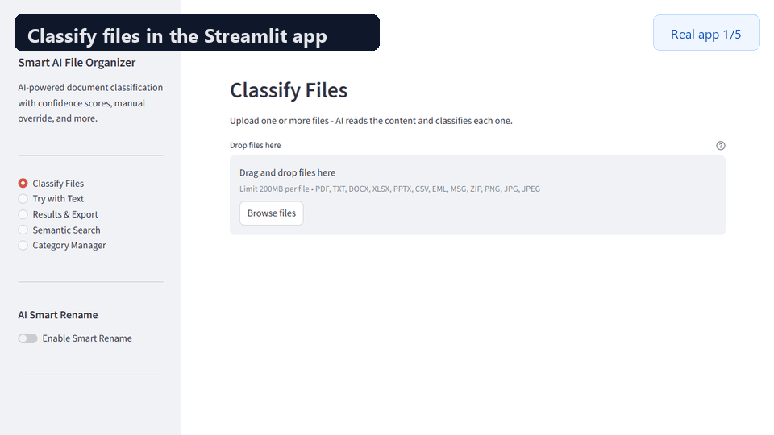

# Smart AI File Organizer

<p align="center">
  
  
  
  
  <a href="https://smart-ai-file-organizer.streamlit.app">
    
  </a>
</p>

<p align="center">
  <strong>AI-powered file organization for messy local folders.</strong><br>
  Classify, rename, deduplicate, and search documents by what they contain, not what they are called.<br>
  Use it from the CLI, desktop GUI, or Streamlit web app.
</p>

<p align="center">
  <a href="#quick-start">Quick Start</a> ·
  <a href="#interfaces">Interfaces</a> ·
  <a href="#demo">Demo</a> ·
  <a href="#usage">Usage</a> ·
  <a href="docs/ROADMAP.md">Roadmap</a>
</p>

## Why This Project?

Most folders become messy because filenames are unreliable: `scan_001.pdf`,
`final_final.docx`, exported spreadsheets, duplicated downloads, and screenshots
all pile up together.

Smart AI File Organizer reads the content inside each file, then gives you a
safer workflow for turning chaos into structure:

- Preview every move with dry-run mode before touching files.
- Classify documents by meaning using transformer embeddings or a fast offline
  TF-IDF fallback.
- Detect duplicates by content hash instead of filename.
- Search organized files semantically, even when you do not remember exact words.
- Keep secrets and personal category rules in local config, outside git.

## Demo

Record a 10-20 second walkthrough from a real local folder that you are safe to
show publicly. Suggested flow: select a folder, run dry-run, organize files,
then search for a document by meaning.

```text
docs/media/demo.gif
```

When the GIF is ready, add it below:

```markdown

```

Media capture guidance lives in [`docs/media/README.md`](docs/media/README.md).

## Before vs After

```text
Before: Downloads/                 After: Downloads/
|-- scan_001.pdf                   |-- Finance/
|-- final_final.docx               |   `-- budget_march.xlsx
|-- notes.txt                      |-- Resume/
|-- report-copy.pdf                |   `-- final_final.docx
|-- IMG_2044.jpg                   |-- Research/
`-- budget_march.xlsx              |   `-- report-copy.pdf
                                   |-- Personal/
                                   |   `-- IMG_2044.jpg
                                   |-- Other/
                                   |   `-- notes.txt
                                   `-- organizer.log
```

With Smart Rename enabled, vague names can become descriptive:

```text
scan0023.pdf       -> Invoice_Amazon_Mar2024_1299.pdf
doc_final_v3.docx  -> Resume_Software_Engineer_2026.docx
untitled_notes.txt -> AI_Transformer_Research_Notes.txt
```

## Features

- Content-aware document classification.
- TXT, CSV, PDF, DOCX, XLSX, PPTX, EML, MSG, ZIP, PNG, JPG, and JPEG support.
- Duplicate detection with content hashes.
- Semantic search across organized folders.
- Dry-run, undo, recursive scan, watch mode, and operation logs.
- Category management, manual overrides, confidence scores, and exports.
- Optional NVIDIA-powered Smart Rename.

## Interfaces

| Interface | Best For | Command |
| --- | --- | --- |
| CLI | Fast local automation and dry runs | `smart-organizer "D:\Downloads" --dry-run` |
| Desktop GUI | Reviewable interactive organization | `smart-organizer-gui` |
| Streamlit | Browser-based demo and uploads | `streamlit run streamlit_app.py` |
| Watch Mode | Continuous folder monitoring | `smart-organizer-watch "D:\Downloads"` |

## Quick Start

```bash
git clone https://github.com/sarawagh27/smart-ai-file-organizer.git
cd smart-ai-file-organizer
python -m venv .venv
.venv\Scripts\activate
python -m pip install --upgrade pip
python -m pip install -e .
```

Install optional AI, web, and OCR extras only when needed:

```bash
python -m pip install -e ".[ai,web]"
python -m pip install -e ".[ocr]"
```

`pyproject.toml` is the canonical dependency manifest. `requirements.txt` is
kept only as a small deployment fallback for platforms that expect it.

## Usage

Preview organization without moving files:

```bash
smart-organizer "D:\Downloads" --dry-run
```

Organize a folder:

```bash
smart-organizer "D:\Downloads"
```

Include subfolders:

```bash
smart-organizer "D:\Downloads" --recursive
```

Enable AI-powered filenames:

```bash
smart-organizer "D:\Downloads" --smart-rename
```

Undo the last run:

```bash
smart-organizer-undo "D:\Downloads"
```

Launch interfaces directly:

```bash
smart-organizer-gui
smart-organizer-watch "D:\Downloads"
streamlit run streamlit_app.py
```

Wrapper scripts still work when you need to run without console commands:

```bash
python scripts/main.py "D:\Downloads" --dry-run
python scripts/gui.py
```

## Configuration

`config.example.json` is the committed template. For local customization:

```bash
copy config.example.json config.json
```

`config.json` is ignored by git because it can contain private API keys and
personal category data. The app falls back to `config.example.json` when no
local config exists.

Smart Rename can read the NVIDIA key from either:

- `NVIDIA_API_KEY`
- `smart_rename.api_key` in local `config.json`

## AI Smart Rename

Smart Rename uses the NVIDIA OpenAI-compatible API to generate cleaner filenames
from extracted document text.

Setup:

1. Get an API key from `https://build.nvidia.com/models`.
2. Copy `config.example.json` to `config.json`.
3. Add your key under `smart_rename.api_key`, or set `NVIDIA_API_KEY`.
4. Run with `--smart-rename`.

## Tech Stack

| Layer | Technology |
| --- | --- |
| Language | Python 3.10+ |
| ML Model | sentence-transformers (`all-MiniLM-L6-v2`) |
| Fallback Classifier | TF-IDF + Multinomial Naive Bayes |
| AI Smart Rename | NVIDIA NIM API (`meta/llama-3.1-8b-instruct`) |
| Language Detection | langdetect |
| Web App | Streamlit |
| Desktop GUI | Tkinter |
| File Extraction | PyPDF2, python-docx, openpyxl, python-pptx, extract-msg |
| Watch Mode | watchdog |

## Project Structure

```text
.
|-- smart_ai_file_organizer/ # Application package
|   |-- main.py              # CLI entry point
|   |-- gui.py               # Tkinter desktop GUI
|   |-- streamlit_app.py     # Streamlit web UI
|   |-- organizer.py         # File organization pipeline
|   |-- classifier.py        # Transformer/TF-IDF document classifier
|   |-- search.py            # Semantic search index and query engine
|   |-- duplicate_detector.py
|   |-- text_extractor.py
|   |-- renamer.py
|   |-- watcher.py
|   `-- undo.py
|-- streamlit_app.py         # Streamlit Cloud wrapper
|-- config.example.json      # Safe committed config template
|-- scripts/                 # Optional local wrapper scripts
|-- docs/                    # Roadmap, changelog, and media guidance
`-- tests/                   # Pytest suite
```

## Development

```bash
python -m pip install -e ".[dev]"
python -m ruff check .
python -m pytest --cov=smart_ai_file_organizer --cov-report=term-missing
python -m build
```

The test suite sets `SMART_ORGANIZER_DISABLE_TRANSFORMERS=1` so CI and local
tests stay fast and offline-friendly. Install the `ai` extra and unset that
environment variable when you want to exercise the transformer path manually.

Release notes live in [`docs/CHANGELOG.md`](docs/CHANGELOG.md), and planned
work lives in [`docs/ROADMAP.md`](docs/ROADMAP.md).

## Customizing Categories

Copy `config.example.json` to `config.json` and edit:

```json
{
  "categories": ["Finance", "Resume", "AI", "MyCategory"],
  "training_data": {
    "MyCategory": ["keywords describing this category..."]
  }
}
```

You can also use the Categories button in the desktop GUI.

## Security Notes

- Do not commit `config.json`, `.env`, logs, indexes, local documents, or API keys.
- Rotate any key that has ever been committed or shared.
- Review organized folders before running live moves on important data; use
  `--dry-run` first.

## Contributing

1. Fork the repository.
2. Create a branch: `git checkout -b feature/your-feature`.
3. Make a focused change and add tests where useful.
4. Run `python -m pytest`.
5. Push and open a pull request.

Full contribution guidance lives in [`.github/CONTRIBUTING.md`](.github/CONTRIBUTING.md).

## License

MIT. See [LICENSE](LICENSE).
